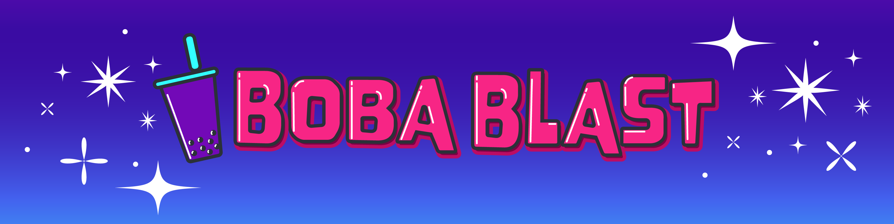
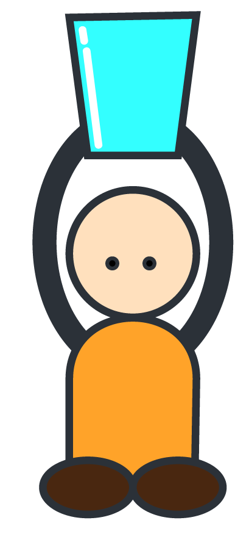
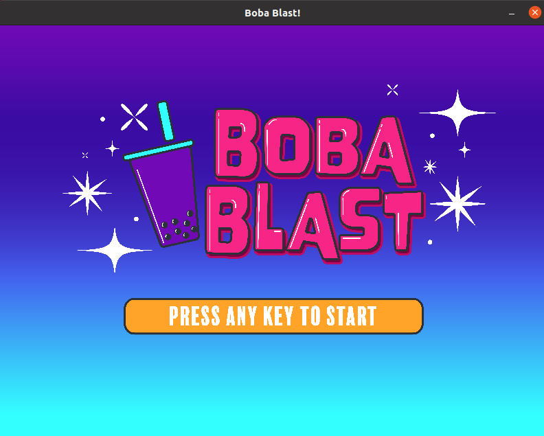
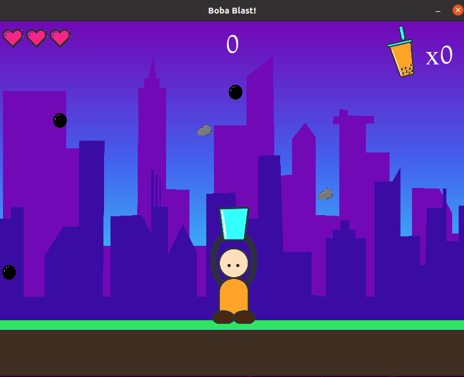
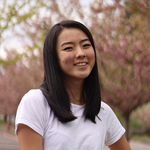

## Welcome! 
In this game, your mission is to collect as many tapioca pearls as you can to make some delicious bubble tea while avoiding the rocks falling from the sky. 

## Project Goal
Our main goal of this project was to create an interactive software that users can interact with. We wanted to create a game that users can play easily and we wanted to focus on the visual game design to create a fun and colorful interface.

## Game Overview
The game starts with the character at the center of the screen with 3 lives. Soon after the game begins, tapioca and rocks start falling from the sky. The player uses the left and right arrow keys to move the character left and right in order to avoid the rocks and to collect the tapioca in the bucket it's carrying. For every 10 tapioca pearls collected, the player makes 1 bubble tea drink. The game ends once the player loses all its lives.

### Game Demo
<iframe width="560" height="315" src="https://www.youtube.com/embed/O2k-xCMZcpo" title="YouTube video player" frameborder="0" allow="accelerometer; autoplay; clipboard-write; encrypted-media; gyroscope; picture-in-picture" allowfullscreen></iframe>

### Character

This is the character the user plays as!

The character can be moved left and right by using the left and right arrows, respectively. The character movement wraps around at the edge of the screen, so the game player can easily move from one edge of the screen to the other.

### Game Visualizations
We created all the game visualizations ourselves using Adobe Illustrator. We wanted our game to convey a happy and exciting vibe in the city to replicate the aesthetic many bubble tea stores have so we used several bright colors for our color palette.

#### Backgrounds
Our game contains 3 displays: a welcome screen, the game play screen, and a game over screen.

  

The game opens up to a welcome screen, and the user can press any key to begin the game. It then transitions to the game play screen. Once the player loses all its lives, the game over screen displays and gives the player the option to play again. To exit the game, the user can simply close the window.

#### Game components

The player statistics are displayed at the top of the game screen. The number of lives are displayed on the upper left corner, the number of tapioca collected is displayed on the top of the screen, and the number of boba drinks are tracked on the upper right corner of the screen. 

### Audio?? Welcome and end screen??

## Installation
A detailed installation guide can be found [here](https://github.com/olincollege/boba-blast/blob/main/README.md)

To play this game, you will need python and pygame installed. You will also need to download all the files in the [boba-blast repository](https://github.com/olincollege/boba-blast). Then, navigate to the boba-blast folder and run the following command in the terminal to start playing: 

<code>$ python main.py</code>

### About Us

 
#### Claire Hashizume
*Olin College of Engineering '24*

Likes traveling, photography, and bubble tea in no particular order.
     

 
#### Berwin Lan
*Olin College of Engineering '24*
    
Big fan of boba, seltzer, and changing her hair color frequently.
      

#### Attribution
We looked at [KidsCanCode](http://kidscancode.org/lessons/) as a resource when starting this project to learn some of the basic components of Pygame.

For our game music and sound effects, we used audio from the following sites:

Music: [bensound.com](https://www.bensound.com/)

Sound effects: [orangefreesounds.com](https://orangefreesounds.com/)
