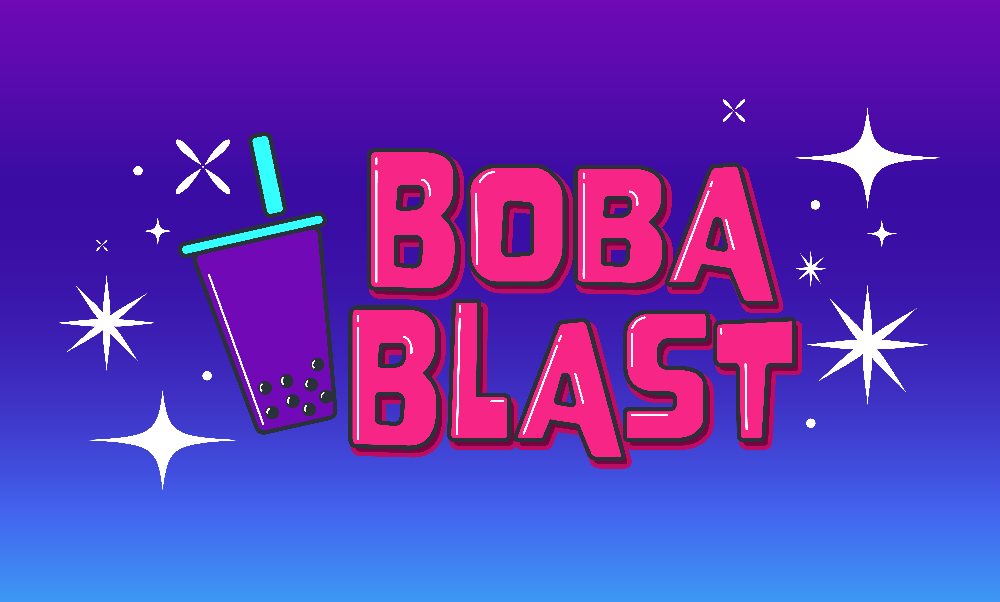

Welcome! "Boba Blast" is a game where the goal of the player is to collect as many tapioca pearls as they can while avoiding the rocks falling from the sky. 

### Project Goal

### Unique Features

### Installation
A detailed installation guide can be found [here](https://github.com/olincollege/boba-blast/blob/main/README.md)

To play this game, you will need pygame installed on python. You will also need to download all the files in the [boba-blast repository](https://github.com/olincollege/boba-blast). Then, navigate to the boba-blast folder and run the following command in the terminal to start playing: 
> $ python main.py

#### About Us

    

#### Attribution
We looked at [KidsCanCode](http://kidscancode.org/lessons/) as
